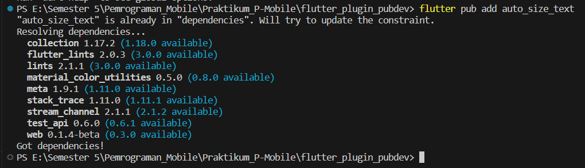
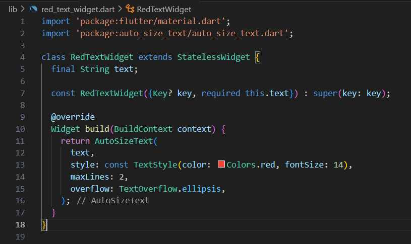
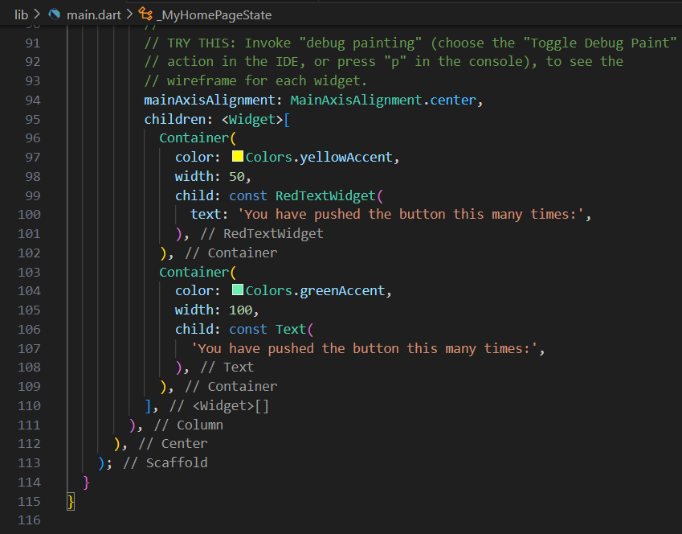
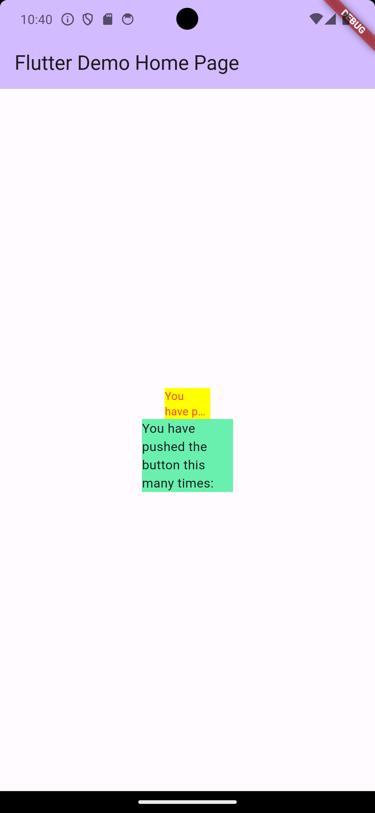

# flutter_plugin_pubdev

> Nama  : Dandy Wahyu Syahputra Kelas: TI - 3A
 NIM: 2141720002

## Praktikum

- Install Plugin: 

- Code: 

> Code return Container() sebelumnya error karena  

- Hasil: 
  

## Tugas Praktikum
1. Selesaikan Praktikum tersebut, lalu dokumentasikan dan push ke repository Anda berupa screenshot hasil pekerjaan beserta penjelasannya di file README.md!

2. Jelaskan maksud dari langkah 2 pada praktikum tersebut!
> Maksud dari langkah 2, perintah `flutter pub add auto_size_text` digunakan untuk secara otomatis menambahkan paket Flutter bernama "auto_size_text" ke proyek Anda. Ini memperbarui berkas proyek Anda, mengunduh dan menginstal paket tersebut, dan memungkinkan Anda untuk menggunakan fungsionalitas dari paket "auto_size_text" dalam proyek Flutter Anda tanpa harus mengelola dependensi secara manual.

3. Jelaskan maksud dari langkah 5 pada praktikum tersebut!
> Maksud dari langkah 5, Terjadi error pada Langkah 4 karena perubahan yang Anda lakukan pada red_text_widget.dart memerlukan beberapa perubahan tambahan dalam proyek Anda. Berikut adalah beberapa penyebab umum error:
>    1. **Impor Paket yang Tidak Dilakukan**: Anda harus mengimpor paket auto_size_text ke dalam berkas red_text_widget.dart agar Anda dapat menggunakan komponen-komponen dari paket tersebut. Jika Anda tidak mengimpor paket ini, maka Flutter tidak akan mengenali simbol AutoSizeText.
>   2. **Variabel text yang Tidak Didefinisikan**: Variabel text yang Anda gunakan dalam AutoSizeText perlu didefinisikan terlebih dahulu di dalam metode build. Variabel ini harus mengandung teks yang akan ditampilkan oleh AutoSizeText.
>   3. **Paket Belum Diunduh**: Perintah flutter pub get belum dijalankan setelah menambahkan dependensi paket. Ini menyebabkan Flutter tidak dapat menemukan paket "auto_size_text" karena paket tersebut belum diunduh dan diinstal dalam proyek Anda.

4. Pada langkah 6 terdapat dua widget yang ditambahkan, jelaskan fungsi dan perbedaannya!
* Penambahan Widget dalam `main.dart`
* Tahap ini melibatkan penambahan dua widget di dalam class `_MyHomePageState` di file `main.dart`.
* `RedTextWidget`: Widget kustom ini menggunakan fungsi `AutoSizeText` dari plugin `auto_size_text` untuk menampilkan teks dengan gaya yang telah ditentukan dalam `RedTextWidget`.
* `Text`: Merupakan widget bawaan dari Flutter yang digunakan untuk menampilkan teks dengan gaya yang telah ditentukan sebelumnya.
* Perbedaan utama terletak pada penggunaan widget kustom (`RedTextWidget`) yang menggunakan fungsi `AutoSizeText` dari plugin `auto_size_text` untuk menampilkan teks, sedangkan widget `Text` merupakan widget bawaan Flutter yang menampilkan teks sesuai dengan gaya yang telah ditetapkan.

5. Jelaskan maksud dari tiap parameter yang ada di dalam plugin auto_size_text berdasarkan tautan pada dokumentasi ini !
* Parameter dalam Plugin `auto_size_text`:

* `text`: Merupakan teks yang akan ditampilkan.
* `style`: Mengatur gaya dari teks yang ditampilkan, seperti warna dan ukuran font.
* `maxLines`: Menentukan jumlah maksimum baris yang akan ditampilkan.
* `overflow`: Menetapkan bagaimana teks akan ditangani jika melebihi jumlah baris maksimum yang telah ditetapkan, seperti contoh penggunaan `TextOverflow.ellipsis` yang akan menampilkan tanda elipsis (...) jika teks terlalu panjang.

6. Kumpulkan laporan praktikum Anda berupa link repository GitHub ke spreadsheet yang telah disediakan!