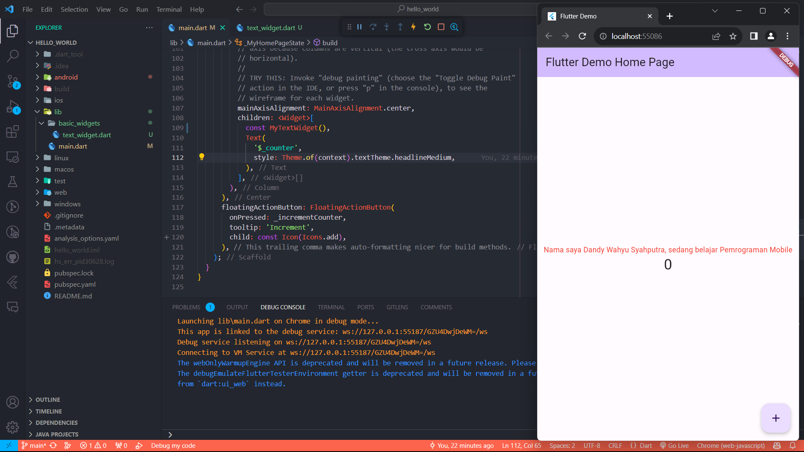
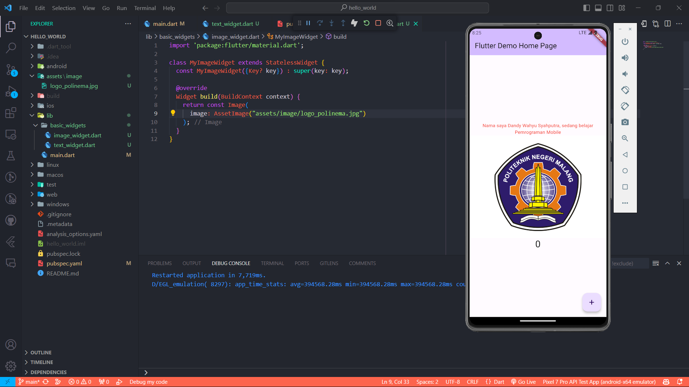
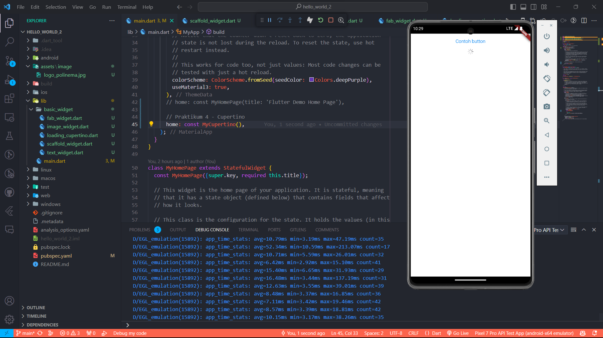
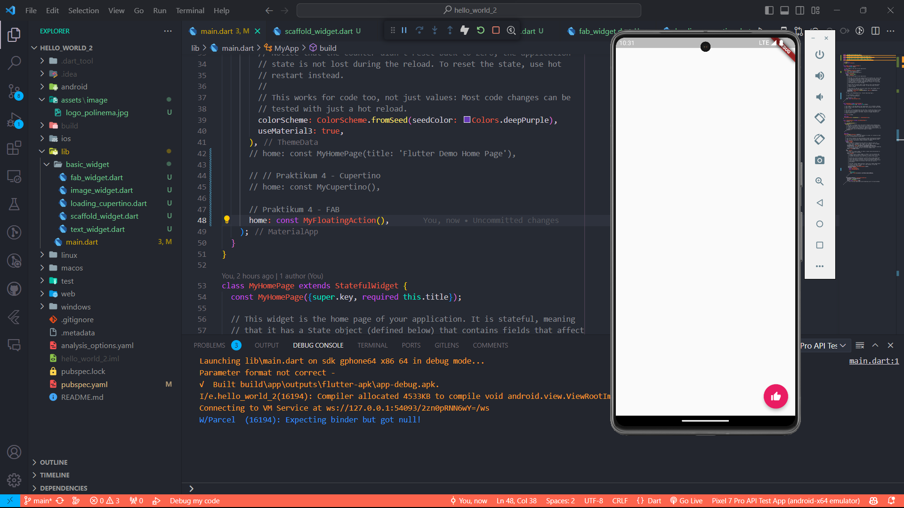
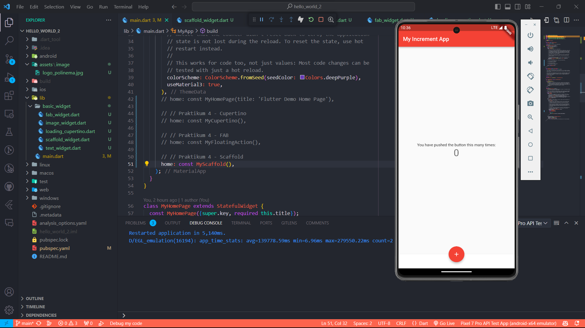
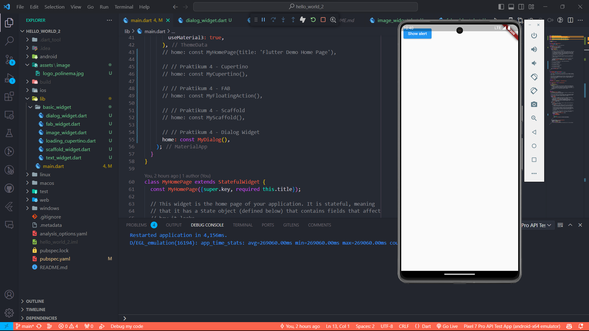
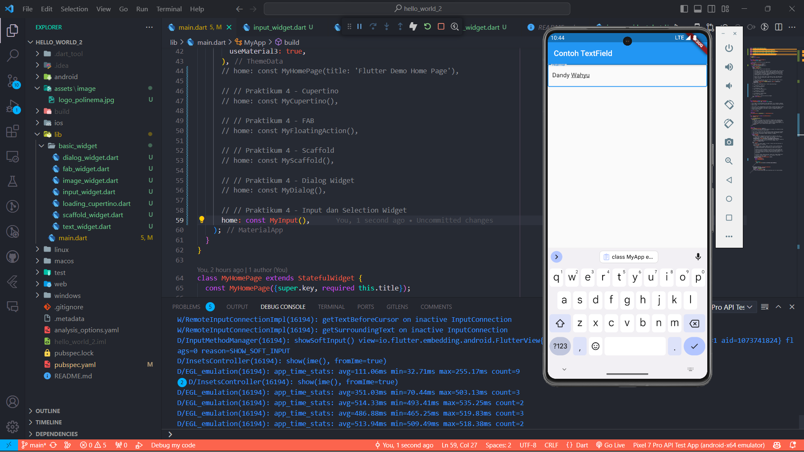
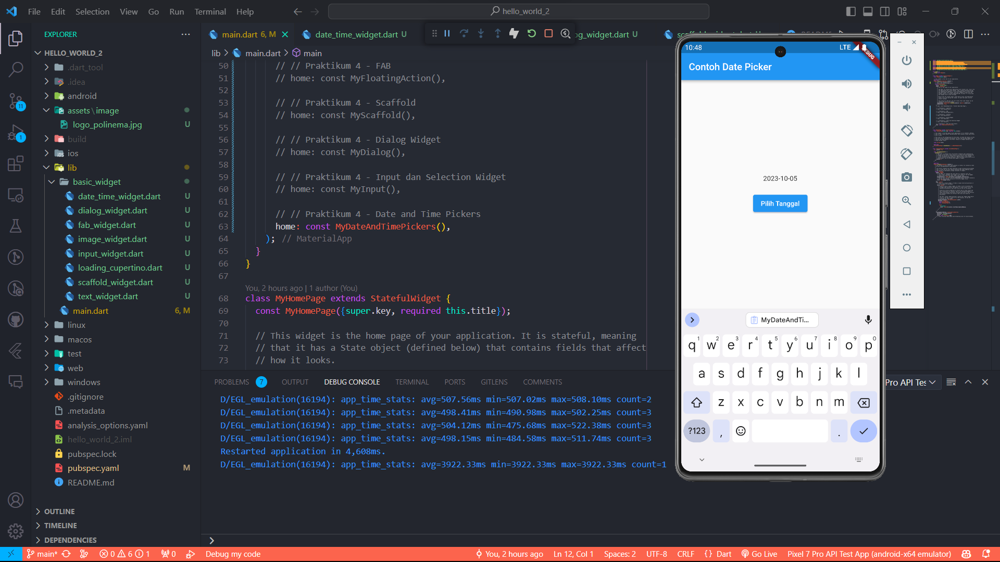

# hello_world_2

A new Flutter project.

## Praktikum 3
### 1. Text Widget

### 2. Image Widget

## Praktikum 4
### 1. Cupertino

### 2. Floating Action Button

### 3. Scaffold

### 4. Dialog

### 5. Input dan Selection

### 6. Date and Time Pickers

