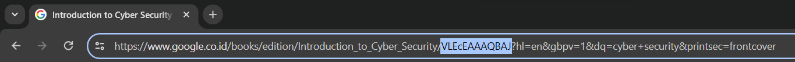
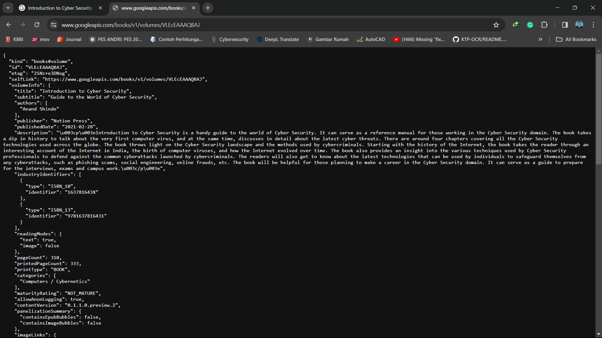
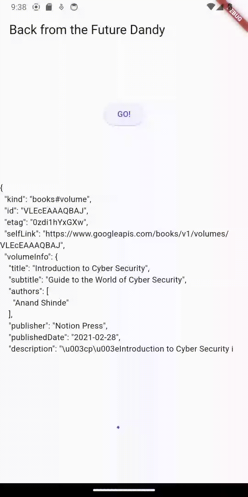
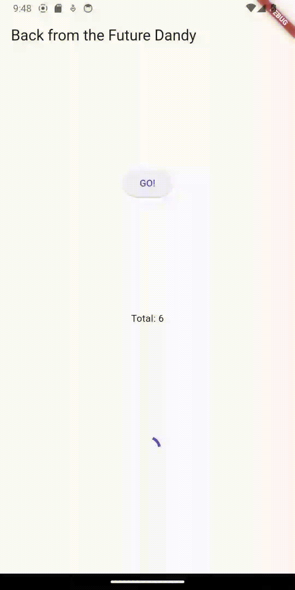

# Week 12
## Praktikum 1
### Soal

1. Tambahkan nama panggilan Anda pada title app sebagai identitas hasil pekerjaan Anda.
2. Carilah judul buku favorit Anda di Google Books, lalu ganti ID buku pada variabel path di kode tersebut. Caranya ambil di URL browser Anda seperti gambar berikut ini.
   > 
   > Kemudian cobalah akses di browser URI tersebut dengan lengkap seperti ini. Jika menampilkan data JSON, maka Anda telah berhasil. Lakukan capture milik Anda dan tulis di README pada laporan praktikum. Lalu lakukan commit dengan pesan "W12: Soal 2".
   > 
3. Jelaskan maksud kode langkah 5 tersebut terkait substring dan catchError!
   Capture hasil praktikum Anda berupa GIF dan lampirkan di README. Lalu lakukan commit dengan pesan "W12: Soal 3".
   >  
   >  `Substring` pada kode tersebut berfungsi untuk mengambil teks dari index 0 sampai 450. Sedangkan `catchError` berfungsi untuk menangkap error yang terjadi pada kode tersebut.

## Praktikum 2
4. Jelaskan maksud kode langkah 1 dan 2 tersebut!
   Capture hasil praktikum Anda berupa GIF dan lampirkan di README. Lalu lakukan commit dengan pesan "W12: Soal 4".

   > 
   >  Pada langkah 1 kita menginisialisasikan 3 method dengan menggunakan fungsi `Future`.delayed dengan lama 3 detik dengan return nilai tertentu. Nah pada langkah ke 2 kita menginisialiasasikan method `count()` yang digunakan untuk memanggil ketiga method sebelumnya dan mengganti variable result dengan jumlah nilai kembali dari ketiga method tersebut.

## Praktikum 3
5. Jelaskan maksud kode langkah 2 tersebut!
   Capture hasil praktikum Anda berupa GIF dan lampirkan di README. Lalu lakukan commit dengan pesan "W12: Soal 5".

   > 
   >  Fungsi kode langkah 2 adalah untuk menginisialisasikan `Completer` untuk mengembalikan nilai hasil `Future` nantinnya.

